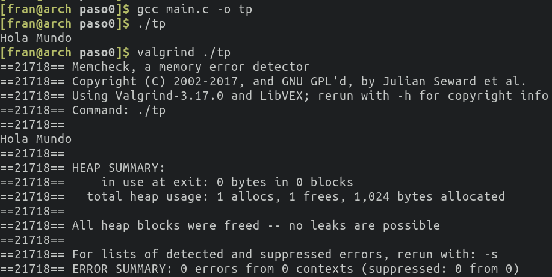
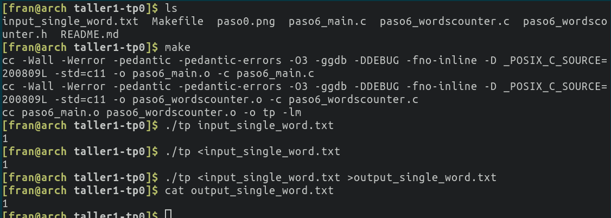
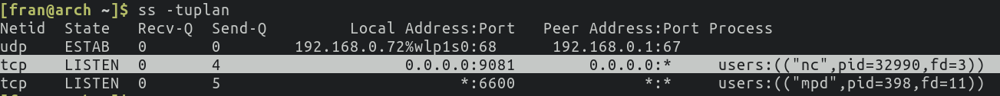
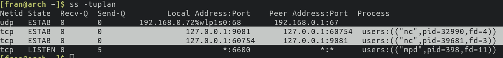
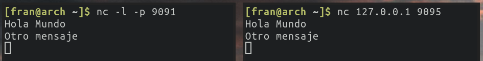
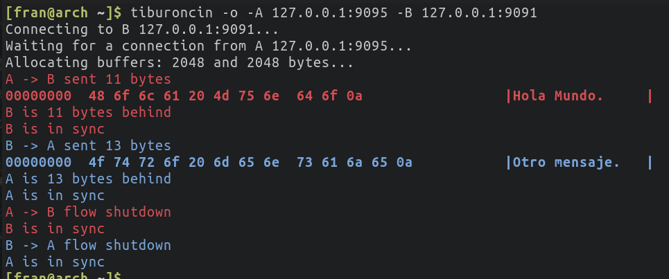

# Contador de Palabras

Alumno: Francisco Viñas

Padrón: 103207

Link al repositorio: https://github.com/franvinas/taller1-tp0

## Paso 0
#### a. Capturas de pantalla de la ejecución del aplicativo (con y sin Valgrind).

#### b. ¿Para qué sirve Valgrind? ¿Cuáles son sus opciones más comunes?

Valgrind es una herramienta que sirve para detectar si hay memoria que fue alocada pero nunca se liberó. Al ejecutar un programa con valgrind vamos a obtener una salida con un **HEAP SUMMARY**. Esta sección de la salida de valgrind nos indica la cantidad de *allocs* y la cantidad de *frees* que se realizar durante la ejecución del programa. 

Algunas de las opciones más comunes son:

* --tool=memcheck
    Corre valgrind con la herramienta que se pasa como parametro. La opción por defecto es memcheck, otras opciones son cachegrind, calgrind, helgrind, etc.
* --leak-check=full
    Con este flag podemos ver una devolución más detalla donde se muestre individualmente cada perdida de memoria. También se podría elegir una versión resumida.
* --show-reachable=yes
    Con este flag valgring muestra las perdidas de memoria de todos los tipos.
* --track-fds=yes
    Con este flag valgrind muestra una lista con los descriptores de archivos que quedaron abiertos una vez que el programa finalizó.

#### c. ¿Qué representa sizeof()? ¿Cuál sería el valor de salida de sizeof(char) y sizeof(int)?

La función *sizeof()* sirve para obtener la cantidad de bytes alocados para una variable o tipo de dato. La salida de esta función para un mismo tipo de dato puede variar según la arquitectura.

El valor de sizeof(char) es 1 y el de sizeof(int) es 4.

#### d. ¿El sizeof() de una struct de C es igual a la suma del sizeof() de cada uno sus elementos? Justifique mediante un ejemplo.

Esto es falso. Si al compilador no le damos ninguna instrucción indicando como queremos que sea el layout, los campos del struct estarán alineados a 4 bytes. 

Como ejemplo, veamos el struct que se muestra a continuación:

~~~c
struct ejemplo {
    char a;
    int b;
    char c;
} ejemplo_t;
~~~

La suma de los sizeof de cada campo es 1 + 4 + 1 = 6. Sin embargo, si calculamos el sizeof de ejemplo_t obtenemos el valor 12. Esto se debe a que los campos se alinean a 4 bytes para que el acceso sea más rápido. En particular para esta estructura se va a usar un byte para la variable a seguido de 3 bytes de padding, luego para la variable b se usan 4 bytes (como es de esperarse para una variable de tipo int) y por último la variable va a ocupar un byte seguido por 3 bytes de padding. Teniendo en cuenta esto, podemos calcular el tamaño del struct como la sumatoria de los tamaños de las variables y los paddings. Esto es:

    1 + 3 + 4 + 1 + 3 = 12

#### e. Investigar la existencia de los archivos estándar: STDIN, STDOUT, STDERR. Explicar brevemente su uso y cómo redirigirlos en caso de ser necesario (caracteres > y <) y como conectar la salida estándar de un proceso a la entrada estándar de otro con un pipe (carácter | ).

Cuando se invoca la función main, ya se encuentran disponibles los tres canales estandar de entrada y salida. Estos son:

* **stdin**: Entrada estandar (canal por cual ingresan datos al programa, en general a través del teclado o tomando la salida de otro programa)

* **stout**: Salida estandar (canal por el cual programa devuelve los datos, en general por la pantalla)

* **stderr**: Error estandar (canal por el cual se envían los mensajes de error en caso de que exista alguno)

Es posible que un programa reciba el contenido de un archivo a través de la entrada estandar. Para esto se hace uso del caractér **<**. Por ejemplo, si tenemos un archivo *entrada.txt* podemos hacer que el programa lo lea como entrada estandar de la siguiente forma:

~~~
$ ./programa < entrada.txt
~~~

También podemos redireccionar la salida estandar y el error estandar. Supongamos que queremos escribir la salida en un archivo *salida.txt* y los errores en un archivo *errores.txt*. Para esto podemos hacer lo siguiente:

~~~
$ ./programa 2> errores.txt > salida.txt
~~~

Si nos interesa escribir en un archivo la salida estandar y que los errores se impriman por pantalla:

~~~
$ ./programa > salida.txt
~~~

Para escribir los errores en un archivo e imprimir por pantalla la salida estandar:

~~~
$ ./programa 2> errores.txt
~~~

Un programa puede tomar como entrada estandar a la salida estandar de otro programa haciendo uso de los pipes (caractér |). Por ejemplo, si tenemos un programa llamado *programa1* que tiene una salida y queremos que esta salida sea recibida por un programa llamado *programa2* como entrada estandar, luego podemos realilzar lo siguiente:

~~~
$ ./programa1 | ./programa2
~~~

## Paso 1: SERCOM - Errores de generación y normas de programación

#### a. Captura de pantalla mostrando los problemas de estilo detectados. Explicar cada uno.

~~~
/task/student//source_unsafe/paso1_wordscounter.c:27:  Missing space before ( in while(  [whitespace/parens] [5]
/task/student//source_unsafe/paso1_wordscounter.c:41:  Mismatching spaces inside () in if  [whitespace/parens] [5]
/task/student//source_unsafe/paso1_wordscounter.c:41:  Should have zero or one spaces inside ( and ) in if  [whitespace/parens] [5]
/task/student//source_unsafe/paso1_wordscounter.c:47:  An else should appear on the same line as the preceding }  [whitespace/newline] [4]
/task/student//source_unsafe/paso1_wordscounter.c:47:  If an else has a brace on one side, it should have it on both  [readability/braces] [5]
/task/student//source_unsafe/paso1_wordscounter.c:48:  Missing space before ( in if(  [whitespace/parens] [5]
/task/student//source_unsafe/paso1_wordscounter.c:53:  Extra space before last semicolon. If this should be an empty statement, use {} instead. [whitespace/semicolon] [5]
/task/student//source_unsafe/paso1_main.c:12:  Almost always, snprintf is better than strcpy  [runtime/printf] [4]
/task/student//source_unsafe/paso1_main.c:15:  An else should appear on the same line as the preceding }  [whitespace/newline] [4]
/task/student//source_unsafe/paso1_main.c:15:  If an else has a brace on one side, it should have it on both  [readability/braces] [5]
/task/student//source_unsafe/paso1_wordscounter.h:5:  Lines should be <= 80 characters long  [whitespace/line_length] [2]
Done processing /task/student//source_unsafe/paso1_wordscounter.c
Done processing /task/student//source_unsafe/paso1_main.c
Done processing /task/student//source_unsafe/paso1_wordscounter.h
Total errors found: 11
~~~

El primer error se debe a que a que no se dejó un epacio despues del while. Lo correcto hubiera sido:

~~~c
    } while (state != STATE_FINISHED);
~~~

Los siguientes dos errores (2 y 3) indican que se dejaron dos espacios despues del parentesis. Lo correcto es:

~~~c
    if (c == EOF) {
~~~

Los siguientes dos errores (4 y 5) se deben a que hay un salto de linea despues del caractér } y antes del else. Lo correcto es:

~~~c
    } else if (state == STATE_IN_WORD) {
~~~

El sexto error es igual al primero pero ahora sobre un if en lugar de un while. Se soluciona agregando un espacio despues de la palabra reservada if.

El último problema de estilo del archivo *paso1_wordscounter.c* se debe a que se dejo un espacio antes del punto y coma. Lo correcto es:

~~~c
    return next_state;
~~~

En el archivo *paso1_main.c* tenemos otros 3 problemas de estilo. El primero se debe a que se hace uso de la función strcpy en lugar de snprintf. Reemplazando la primera por la segunda se soluciona este problema. Los otros dos problemas dentro de este archivo se deben a que hay un salto de linea despues del caractér { y antes del else. 

El último problema de estilo se encuentra en el archivo *paso1_wordscounter.h*. Hay una linea que tiene más de 80 caracteres. Esta línea corresponde a un comentario, para solucionar este problema podemos reescribir el comentario de forma tal que sea más corto o usar dos lineas.

#### b. Captura de pantalla indicando los errores de generación del ejecutable. Explicar cada uno e indicar si se trata de errores del compilador o del linker.

~~~
Descomprimiendo el codigo 'source_unsafe.zip'...
Archive:  source_unsafe.zip
  inflating: source_unsafe/README.md
  inflating: source_unsafe/paso0.png
  inflating: source_unsafe/paso1_main.c
  inflating: source_unsafe/paso1_wordscounter.c
  inflating: source_unsafe/paso1_wordscounter.h
Compilando el codigo...
cc -Wall -Werror -pedantic -pedantic-errors -O3 -ggdb -DDEBUG -fno-inline -D _POSIX_C_SOURCE=200809L -Dwrapsocks=1 -std=c11 -o paso1_main.o -c paso1_main.c
paso1_main.c: In function 'main':
paso1_main.c:22:9: error: unknown type name 'wordscounter_t'
   22 |         wordscounter_t counter;
      |         ^~~~~~~~~~~~~~
paso1_main.c:23:9: error: implicit declaration of function 'wordscounter_create' [-Wimplicit-function-declaration]
   23 |         wordscounter_create(&counter);
      |         ^~~~~~~~~~~~~~~~~~~
paso1_main.c:24:9: error: implicit declaration of function 'wordscounter_process' [-Wimplicit-function-declaration]
   24 |         wordscounter_process(&counter, input);
      |         ^~~~~~~~~~~~~~~~~~~~
paso1_main.c:25:24: error: implicit declaration of function 'wordscounter_get_words' [-Wimplicit-function-declaration]
   25 |         size_t words = wordscounter_get_words(&counter);
      |                        ^~~~~~~~~~~~~~~~~~~~~~
paso1_main.c:27:9: error: implicit declaration of function 'wordscounter_destroy' [-Wimplicit-function-declaration]
   27 |         wordscounter_destroy(&counter);
      |         ^~~~~~~~~~~~~~~~~~~~
make: *** [/task/student/MakefileTP0:145: paso1_main.o] Error 1

real    0m0.040s
user    0m0.018s
sys     0m0.013s
[Error] Fallo la compilacion del codigo en 'source_unsafe.zip'. Codigo de error 2
~~~

Hay 5 errores correspondientes al proceso de compilación. Estos errores se deben a que no se hace el #include correspondiente a la librería *paso1_wordscounter.h*

#### c. ¿El sistema reportó algún WARNING? ¿Por qué?

El sistema no reportó ningún WARNING porque estamos usando el flag -Werror, por lo tanto todos los WARNINGS son considerados errores.

## Paso 2: SERCOM - Errores de generación 2

#### a. Describa en breves palabras las correcciones realizadas respecto de la versión anterior.

Haciendo uso del comando diff podemos ver las modificaciones realizadas:

~~~
diff paso1_main.c paso2_main.c || diff paso1_wordscounter.c paso2_wordscounter.c || diff paso1_wordscounter.h paso2_wordscounter.h
~~~

Las modificaciones fueron:

* Se incluye la libreria *paso2_wordscounter.h* en el archivo con el programa principal
* Se reemplaza el srtcpy por memcpy
* Se solucionan todos los problemas de estilo mencionados anteriormente

#### b. Captura de pantalla indicando la correcta ejecución de verificación de normas de programación.

~~~
Done processing /task/student//source_unsafe/paso2_wordscounter.h
Done processing /task/student//source_unsafe/paso2_main.c
Done processing /task/student//source_unsafe/paso2_wordscounter.c
~~~

#### c. Captura de pantalla indicando los errores de generación del ejecutable. Explicar cada uno e indicar si se trata de errores del compilador o del linker.

~~~
Descomprimiendo el codigo 'source_unsafe.zip'...
Archive:  source_unsafe.zip
  inflating: source_unsafe/README.md
  inflating: source_unsafe/paso0.png
  inflating: source_unsafe/paso2_main.c
  inflating: source_unsafe/paso2_wordscounter.c
  inflating: source_unsafe/paso2_wordscounter.h
Compilando el codigo...
cc -Wall -Werror -pedantic -pedantic-errors -O3 -ggdb -DDEBUG -fno-inline -D _POSIX_C_SOURCE=200809L -Dwrapsocks=1 -std=c11 -o paso2_wordscounter.o -c paso2_wordscounter.c
In file included from paso2_wordscounter.c:1:
paso2_wordscounter.h:7:5: error: unknown type name 'size_t'
    7 |     size_t words;
      |     ^~~~~~
paso2_wordscounter.h:20:1: error: unknown type name 'size_t'
   20 | size_t wordscounter_get_words(wordscounter_t *self);
      | ^~~~~~
paso2_wordscounter.h:1:1: note: 'size_t' is defined in header '<stddef.h>'; did you forget to '#include <stddef.h>'?
  +++ |+#include <stddef.h>
    1 | #ifndef __WORDSCOUNTER_H__
paso2_wordscounter.h:25:49: error: unknown type name 'FILE'
   25 | void wordscounter_process(wordscounter_t *self, FILE *text_file);
      |                                                 ^~~~
paso2_wordscounter.h:1:1: note: 'FILE' is defined in header '<stdio.h>'; did you forget to '#include <stdio.h>'?
  +++ |+#include <stdio.h>
    1 | #ifndef __WORDSCOUNTER_H__
paso2_wordscounter.c:17:8: error: conflicting types for 'wordscounter_get_words'
   17 | size_t wordscounter_get_words(wordscounter_t *self) {
      |        ^~~~~~~~~~~~~~~~~~~~~~
In file included from paso2_wordscounter.c:1:
paso2_wordscounter.h:20:8: note: previous declaration of 'wordscounter_get_words' was here
   20 | size_t wordscounter_get_words(wordscounter_t *self);
      |        ^~~~~~~~~~~~~~~~~~~~~~
paso2_wordscounter.c: In function 'wordscounter_next_state':
paso2_wordscounter.c:30:25: error: implicit declaration of function 'malloc' [-Wimplicit-function-declaration]
   30 |     char* delim_words = malloc(7 * sizeof(char));
      |                         ^~~~~~
paso2_wordscounter.c:30:25: error: incompatible implicit declaration of built-in function 'malloc' [-Werror]
paso2_wordscounter.c:5:1: note: include '<stdlib.h>' or provide a declaration of 'malloc'
    4 | #include <stdbool.h>
  +++ |+#include <stdlib.h>
    5 |
cc1: all warnings being treated as errors
make: *** [/task/student/MakefileTP0:145: paso2_wordscounter.o] Error 1

real    0m0.036s
user    0m0.024s
sys     0m0.008s
[Error] Fallo la compilacion del codigo en 'source_unsafe.zip'. Codigo de error 2
~~~

Los errores que se muestran son errores de compilación y son consecuencia de hacer uso de la función malloc y de los tipos size_t y FILE sin antes incluir las librerias que corresponden. Para evitar este error se pueden realizar las siguientes incluciones:

~~~c
#include <stddef.h>
#include <stdio.h>
#include <stdlib.h>
~~~

## Paso 3: SERCOM - Errores de generación 3

#### a. Describa en breves palabras las correcciones realizadas respecto de la versión anterior.

Nuevamente, haciendo uso del comando diff podemos ver las modificaciones realizadas:

~~~
diff paso2_main.c paso3_main.c || diff paso2_wordscounter.c paso3_wordscounter.c || diff paso2_wordscounter.h paso3_wordscounter.h
~~~

Las únicas modificaciones que se aplicaron son las siguientes incluciones de librerías:

~~~c
#include <stdlib.h>
#include <string.h>
#include <stdio.h>
~~~

#### b. Captura de pantalla indicando los errores de generación del ejecutable. Explicar cada uno e indicar si se trata de errores del compilador o del linker.

~~~
Descomprimiendo el codigo 'source_unsafe.zip'...
Archive:  source_unsafe.zip
  inflating: source_unsafe/README.md
  inflating: source_unsafe/paso0.png
  inflating: source_unsafe/paso3_main.c
  inflating: source_unsafe/paso3_wordscounter.c
  inflating: source_unsafe/paso3_wordscounter.h
Compilando el codigo...
cc -Wall -Werror -pedantic -pedantic-errors -O3 -ggdb -DDEBUG -fno-inline -D _POSIX_C_SOURCE=200809L -Dwrapsocks=1 -std=c11 -o paso3_wordscounter.o -c paso3_wordscounter.c
cc -Wall -Werror -pedantic -pedantic-errors -O3 -ggdb -DDEBUG -fno-inline -D _POSIX_C_SOURCE=200809L -Dwrapsocks=1 -std=c11 -o paso3_main.o -c paso3_main.c
cc paso3_wordscounter.o paso3_main.o -o tp -lm -Wl,--wrap=send -Wl,--wrap=recv
/usr/bin/ld: paso3_main.o: in function `main':
/task/student/source_unsafe/paso3_main.c:27: undefined reference to `wordscounter_destroy'
collect2: error: ld returned 1 exit status
make: *** [/task/student/MakefileTP0:136: tp] Error 1

real    0m0.130s
user    0m0.088s
sys     0m0.036s
[Error] Fallo la compilacion del codigo en 'source_unsafe.zip'. Codigo de error 2
~~~

Es decir, el único error es el siguiente:

~~~
paso3_main.c:27: undefined reference to `wordscounter_destroy'
~~~

Este es un error del linker y se debe a que la funcion wordscounter_destroy está declarada en *paso3_wordscounter.h* pero no se define en ninguno de los archivos.

## Paso 4: SERCOM - Memory Leaks y Buffer Overflows

#### a. Describa en breves palabras las correcciones realizadas respecto de la versión anterior.

Se agregó la definición de la función wordscounter_destroy. Esta función deberia liberar los bytes alocados y por ahora no hace nada, como consecuencia falla la ejecución con Valgrind.

#### b. Captura de pantalla del resultado de ejecución con Valgrind de la prueba ‘TDA’. Describir los errores reportados por Valgrind.

~~~
==00:00:00:00.000 60== Memcheck, a memory error detector
==00:00:00:00.000 60== Copyright (C) 2002-2017, and GNU GPL'd, by Julian Seward et al.
==00:00:00:00.000 60== Using Valgrind-3.15.0 and LibVEX; rerun with -h for copyright info
==00:00:00:00.000 60== Command: ./tp input_tda.txt
==00:00:00:00.000 60== Parent PID: 59
==00:00:00:00.000 60==
==00:00:00:00.676 60==
==00:00:00:00.676 60== FILE DESCRIPTORS: 5 open at exit.
==00:00:00:00.676 60== Open file descriptor 4: input_tda.txt
==00:00:00:00.676 60==    at 0x495FEAB: open (open64.c:48)
==00:00:00:00.676 60==    by 0x48E2195: _IO_file_open (fileops.c:189)
==00:00:00:00.676 60==    by 0x48E2459: _IO_file_fopen@@GLIBC_2.2.5 (fileops.c:281)
==00:00:00:00.676 60==    by 0x48D4B0D: __fopen_internal (iofopen.c:75)
==00:00:00:00.676 60==    by 0x48D4B0D: fopen@@GLIBC_2.2.5 (iofopen.c:86)
==00:00:00:00.676 60==    by 0x109177: main (paso4_main.c:14)
==00:00:00:00.676 60==
==00:00:00:00.676 60== Open file descriptor 3: /task/student/cases/tda/__valgrind__
==00:00:00:00.676 60==    <inherited from parent>
==00:00:00:00.676 60==
==00:00:00:00.676 60== Open file descriptor 2: /task/student/cases/tda/__stderr__
==00:00:00:00.676 60==    <inherited from parent>
==00:00:00:00.676 60==
==00:00:00:00.676 60== Open file descriptor 1: /task/student/cases/tda/__stdout__
==00:00:00:00.676 60==    <inherited from parent>
==00:00:00:00.676 60==
==00:00:00:00.676 60== Open file descriptor 0: /task/student/cases/tda/__stdin__
==00:00:00:00.676 60==    <inherited from parent>
==00:00:00:00.676 60==
==00:00:00:00.676 60==
==00:00:00:00.676 60== HEAP SUMMARY:
==00:00:00:00.676 60==     in use at exit: 1,977 bytes in 216 blocks
==00:00:00:00.676 60==   total heap usage: 218 allocs, 2 frees, 10,169 bytes allocated
==00:00:00:00.676 60==
==00:00:00:00.676 60== 472 bytes in 1 blocks are still reachable in loss record 1 of 2
==00:00:00:00.676 60==    at 0x483B7F3: malloc (in /usr/lib/x86_64-linux-gnu/valgrind/vgpreload_memcheck-amd64-linux.so)
==00:00:00:00.676 60==    by 0x48D4AAD: __fopen_internal (iofopen.c:65)
==00:00:00:00.676 60==    by 0x48D4AAD: fopen@@GLIBC_2.2.5 (iofopen.c:86)
==00:00:00:00.676 60==    by 0x109177: main (paso4_main.c:14)
==00:00:00:00.676 60==
==00:00:00:00.676 60== 1,505 bytes in 215 blocks are definitely lost in loss record 2 of 2
==00:00:00:00.676 60==    at 0x483B7F3: malloc (in /usr/lib/x86_64-linux-gnu/valgrind/vgpreload_memcheck-amd64-linux.so)
==00:00:00:00.676 60==    by 0x109301: wordscounter_next_state (paso4_wordscounter.c:35)
==00:00:00:00.676 60==    by 0x1093B5: wordscounter_process (paso4_wordscounter.c:30)
==00:00:00:00.676 60==    by 0x109197: main (paso4_main.c:24)
==00:00:00:00.676 60==
==00:00:00:00.676 60== LEAK SUMMARY:
==00:00:00:00.676 60==    definitely lost: 1,505 bytes in 215 blocks
==00:00:00:00.676 60==    indirectly lost: 0 bytes in 0 blocks
==00:00:00:00.676 60==      possibly lost: 0 bytes in 0 blocks
==00:00:00:00.676 60==    still reachable: 472 bytes in 1 blocks
==00:00:00:00.676 60==         suppressed: 0 bytes in 0 blocks
==00:00:00:00.676 60==
==00:00:00:00.676 60== For lists of detected and suppressed errors, rerun with: -s
==00:00:00:00.676 60== ERROR SUMMARY: 1 errors from 1 contexts (suppressed: 0 from 0)
~~~

Valgrind reporta los siguientes dos errores:
* Hay 472 bytes no liberados que fueron alocados en la linea 14 del archivo *paso4_main.c*. En esta linea se abre el archivo entrada. Para liberar estos bytes hay que cerrar el archivo con la funcion fclose.
* Hay 1505 bytes que fueron alocados en la línea 35 del archivo *paso4_wordscounter.c* a través de un malloc y nunca fueron liberados.

#### c. Captura de pantalla del resultado de ejecución con Valgrind de la prueba ‘Long Filename’. Describir los errores reportados por Valgrind.

~~~
**00:00:00:00.646 48** *** memcpy_chk: buffer overflow detected ***: program terminated
==00:00:00:00.000 48== Memcheck, a memory error detector
==00:00:00:00.000 48== Copyright (C) 2002-2017, and GNU GPL'd, by Julian Seward et al.
==00:00:00:00.000 48== Using Valgrind-3.15.0 and LibVEX; rerun with -h for copyright info
==00:00:00:00.000 48== Command: ./tp input_extremely_long_filename.txt
==00:00:00:00.000 48== Parent PID: 47
==00:00:00:00.000 48==
**00:00:00:00.646 48** *** memcpy_chk: buffer overflow detected ***: program terminated
==00:00:00:00.646 48==    at 0x483E9CC: ??? (in /usr/lib/x86_64-linux-gnu/valgrind/vgpreload_memcheck-amd64-linux.so)
==00:00:00:00.646 48==    by 0x4843C0A: __memcpy_chk (in /usr/lib/x86_64-linux-gnu/valgrind/vgpreload_memcheck-amd64-linux.so)
==00:00:00:00.646 48==    by 0x109168: memcpy (string_fortified.h:34)
==00:00:00:00.646 48==    by 0x109168: main (paso4_main.c:13)
==00:00:00:00.664 48==
==00:00:00:00.664 48== FILE DESCRIPTORS: 4 open at exit.
==00:00:00:00.664 48== Open file descriptor 3: /task/student/cases/nombre_largo/__valgrind__
==00:00:00:00.664 48==    <inherited from parent>
==00:00:00:00.664 48==
==00:00:00:00.664 48== Open file descriptor 2: /task/student/cases/nombre_largo/__stderr__
==00:00:00:00.664 48==    <inherited from parent>
==00:00:00:00.664 48==
==00:00:00:00.664 48== Open file descriptor 1: /task/student/cases/nombre_largo/__stdout__
==00:00:00:00.664 48==    <inherited from parent>
==00:00:00:00.664 48==
==00:00:00:00.664 48== Open file descriptor 0: /task/student/cases/nombre_largo/__stdin__
==00:00:00:00.664 48==    <inherited from parent>
==00:00:00:00.664 48==
==00:00:00:00.664 48==
==00:00:00:00.664 48== HEAP SUMMARY:
==00:00:00:00.664 48==     in use at exit: 0 bytes in 0 blocks
==00:00:00:00.664 48==   total heap usage: 0 allocs, 0 frees, 0 bytes allocated
==00:00:00:00.664 48==
==00:00:00:00.664 48== All heap blocks were freed -- no leaks are possible
==00:00:00:00.664 48==
==00:00:00:00.664 48== For lists of detected and suppressed errors, rerun with: -s
==00:00:00:00.664 48== ERROR SUMMARY: 0 errors from 0 contexts (suppressed: 0 from 0)
~~~

Valgrind detecta un buffer overflow e indica que el problema se encuentra al invocar la función memcpy en la línea 13 del archivo *paso4_main.c*.

#### d. ¿Podría solucionarse este error utilizando la función strncpy? ¿Qué hubiera ocurrido con la ejecución de la prueba?

Reemplazando memcpy por strcpy obtendríamos el siguiente error:

~~~
paso4_main.c: In function ‘main’:
paso4_main.c:13:9: error: ‘strncpy’ specified bound depends on the length of the source argument [-Werror=stringop-truncation]
   13 |         strncpy(filepath, argv[1], strlen(argv[1]) + 1);
      |         ^~~~~~~~~~~~~~~~~~~~~~~~~~~~~~~~~~~~~~~~~~~~~~~
paso4_main.c:13:36: note: length computed here
   13 |         strncpy(filepath, argv[1], strlen(argv[1]) + 1);
      |                                    ^~~~~~~~~~~~~~~
cc1: all warnings being treated as errors
~~~

Para solucionar este problema podríamos asignarle a filepath una longitud mayor y mantener la función memcpy. Otra opción es llamar a la funcion fopen pasando como parametro directamente el string con el nombre del archivo. Esto es:

~~~
    input = fopen(argv[1], "r");
~~~

#### e. Explicar de qué se trata un segmentation fault y un buffer overflow.

El error de segmentation fault ocurre cuando se quiere acceder a posiciones de memoria sin los permisos correspondientes para ello. Por otro lado, el error de buffer overflow ocurre cuando se quiere escribir sobre un buffer una cantidad de bytes mayor al tamaño del mismo.

## Paso 5: SERCOM - Código de retorno y salida estándar

#### a. Describa en breves palabras las correcciones realizadas respecto de la versión anterior.

* Se quitaron las líneas donde se declaraba el buffer donde luego se copiaba el nombre del archivo. Esto se reemplazo por una sola linea que abre el archivo de la forma *input = fopen(argv[1], "r");*. Esto evita el problema que existía en el paso anterior con los nombres de archivos largos.
* Ahora se cierran los archivos para evitar que queden esos bytes sin ser liberados.
* Se modificó el método por el cual se define el arreglo con los caracteres separadores. Ahora se hace de forma más compacta en una sola línea.

#### b. Describa el motivo por el que fallan las prueba ‘Invalid File’ y ‘Single Word’. ¿Qué información entrega SERCOM para identificar el error? Realice una captura de pantalla.

La prueba 'Invalid File' falla porque el SERCOM espera que el programa retorne un 1 y esto no se cumple. El SERCOM nos dá esta información de la siguiente manera:

~~~
[=>] Comparando archivo_invalido/__return_code__...
1c1
< 255
---
> 1
~~~

En esta salida del SERCOM podemos ver que el código de retorno esperado es el 1 y el programa está retornando el -1 (en el SERCOM vemos el 255 pero es equivalente).

Por otro lado, la prueba 'Single Word' falla en la salida del programa. El SERCOM nos comunica este error de la siguiente forma:

~~~
[=>] Comparando una_palabra/__stdout__...
1c1
< 0
---
> 1
~~~

El SERCOM espera que la salida del programa sea un 1 y el programa que se usa en este paso tiene como salida un 0.

#### c. Captura de pantalla de la ejecución del comando hexdump. ¿Cuál es el último carácter del archivo input_single_word.txt?

~~~
00000000  77 6f 72 64                                       |word|
00000004
~~~

El último caracter del archivo *input_single_word.txt* es que corresponde en la tabla ascii al valor hexadecimal 64. Este es el caracter 'd'.

#### d. Captura de pantalla con el resultado de la ejecución con gdb. Explique brevemente los comandos utilizados en gdb. ¿Por qué motivo el debugger no se detuvo en el breakpoint de la *línea 45: self->words++;*?

~~~
GNU gdb (GDB) 10.2
Copyright (C) 2021 Free Software Foundation, Inc.
License GPLv3+: GNU GPL version 3 or later <http://gnu.org/licenses/gpl.html>
This is free software: you are free to change and redistribute it.
There is NO WARRANTY, to the extent permitted by law.
Type "show copying" and "show warranty" for details.
This GDB was configured as "x86_64-pc-linux-gnu".
Type "show configuration" for configuration details.
For bug reporting instructions, please see:
<https://www.gnu.org/software/gdb/bugs/>.
Find the GDB manual and other documentation resources online at:
    <http://www.gnu.org/software/gdb/documentation/>.

For help, type "help".
Type "apropos word" to search for commands related to "word"...
Reading symbols from ./tp...
(gdb) info functions
All defined functions:

File paso5_main.c:
9:	int main(int, char **);

File paso5_wordscounter.c:
14:	void wordscounter_create(wordscounter_t *);
18:	void wordscounter_destroy(wordscounter_t *);
22:	size_t wordscounter_get_words(wordscounter_t *);
26:	void wordscounter_process(wordscounter_t *, FILE *);
34:	static char wordscounter_next_state(wordscounter_t *, char, char);

Non-debugging symbols:
0x0000000000001000  _init
0x0000000000001030  fclose@plt
0x0000000000001040  __stack_chk_fail@plt
0x0000000000001050  strchr@plt
0x0000000000001060  printf@plt
0x0000000000001070  fopen@plt
0x0000000000001080  getc@plt
0x0000000000001140  _start
0x0000000000001170  deregister_tm_clones
0x00000000000011a0  register_tm_clones
0x00000000000011e0  __do_global_dtors_aux
0x0000000000001230  frame_dummy
0x0000000000001320  __libc_csu_init
0x0000000000001390  __libc_csu_fini
0x0000000000001398  _fini
(gdb) list wordscounter_next_state
33	
34	static char wordscounter_next_state(wordscounter_t *self, char state, char c) {
35	    const char* delim_words = " ,.;:\n";
36	
37	    char next_state = state;
38	    if (c == EOF) {
39	        next_state = STATE_FINISHED;
40	    } else if (state == STATE_WAITING_WORD) {
41	        if (strchr(delim_words, c) == NULL)
42	            next_state = STATE_IN_WORD;
(gdb) list
43	    } else if (state == STATE_IN_WORD) {
44	        if (strchr(delim_words, c) != NULL) {
45	            self->words++;
46	            next_state = STATE_WAITING_WORD;
47	        }
48	    }
49	    return next_state;
50	}
51	
(gdb) break 45
Breakpoint 1 at 0x12a0: file paso5_wordscounter.c, line 45.
(gdb) run input_single_word.txt
Starting program: /home/fran/docs/fiuba/taller-de-programacion/codigo/ejercicios/ej0/pasos/paso5/tp input_single_word.txt
0
[Inferior 1 (process 367911) exited normally]
(gdb) quit
~~~

* **info functions**: Este comando imprime una lista con las declaraciones de todas las funciones declaradas en los modulos con los que se compiló.
* **list wordscounter_next_state**: Imprime lineas de código donde se define la función wordscounter_next_state.
* **list**: Imprime las lineas de código que están debajo de las impresas con el último comando.
* **break 45**: Establece un punto de quiebre en la línea 45 del archivo que esta siendo actualmente procesado.
* **run input_single_word.txt**: Corre el programa con input_single_word.txt como argumento.
* **quit**: Salir de gdb.

El debugger no se detuvo en el breakpoint de la *línea 45: self->words++;* porque después de ejecutar los comandos *list wordscounter_next_state* y *list* el debugger se encontraba en la línea 51. El punto de quiebre se estableció en una línea por la cual el debugger nunca volvió a pasar.

## Paso 6: SERCOM - Entrega exitosa

#### a. Describa en breves palabras las correcciones realizadas respecto de la versión anterior.

* Se modifica el codigo de retorno de ERROR. Antes era -1 y ahora es 1.
* Para definir los caracteres separadores se utliza la directiva #define. Antes se usaba un const char*
* Se corrigió la función *wordscounter_next_state* para solucionar el problema que ocurría en el paso anterior con el archivo de entrada input_single_word.txt

#### b. Captura de pantalla mostrando todas las entregas realizadas, tanto exitosas como fallidas.

#### c. Captura de pantalla mostrando la ejecución de la prueba ‘Single Word’ de forma local con las distintas variantes indicadas.

## Paso 8: Netcat, ss y tiburoncin

Ejecuto en una consola el siguiente comando:

~~~
nc -l -p 9081
~~~
 
* El flag "-l" le indica a netcat que debe estar en modo escucha (listen mode)
* El flag "-p" permite indicar el puerto

En otra consola ejecuto:

~~~
ss -tuplan
~~~

En la captura de pantalla que se muestra a continuación se ve la salida del comando. Está resaltada la línea que corresponde a netcat

En una tercer consola ejecuto:

~~~
nc 127.0.0.1 9081
~~~

'netcat' se queda bloqueado esperando un input. Podemos escribir un mensaje y al presionar enter lo veremos en la primera consola.

Ejecuto nuevamente 'ss -tuplan'. Ahora en la salida se ven 2 'netcat'. En la siguiente imagen se pueden ver estos dos resaltados.

Cierro ambos netcats. En una consola abro un nuevo netcat:

~~~
nc -l -p 9091
~~~

En otra consola lanzo **tiburoncin** (https://github.com/eldipa/tiburoncin):

~~~
tiburoncin -o -A 127.0.0.1:9095 -B 127.0.0.1:9091
~~~

Tiburoncin se conecta al primer netcat y queda "en espera" a que otro programa se conecte a él. En una tercera consola lanzo un segundo netcat:

~~~
nc 127.0.0.1 9095
~~~

En el segundo netcat escribo el mensaje "Hola Mundo" y presiono enter. El mensaje es enviado al otro netcat. Luego, en el primer netcat escribo el mensaje "Otro mensaje", presiono enter y veo el mensaje en el segundo netcat.

Por otro lado, en la consola que está corriendo tiburoncin se puede ver lo siguiente:

Las primera tres lineas corresponden a información sobre la conexión. Nos indica donde espera poder establecer ambas conexiones y si pudo efectivamente conectarse o si está en espera. Además, nos indica que el tamaño de ambos buffers es de 2048 bytes cada uno. Luego, por cada mensaje se muestran cuatro líneas con la siguiente información:

* La primera linea indica quien es el emisor y quien es el receptor del mensaje. Además de la cantidad de bytes correspondientes a dicho mensaje.
* La segunda linea muestra la salida de hexdump (con el flag -C) con el mensaje como argumento
* Las otras dos lineas mustran información sobre la sincronización entre los extremos de la conexión. Si A le manda un mensaje de 4 bytes a B, entonces B estará 4 bytes por detrás de la sincronización hasta que le llegue el mensaje.

Las últimas cuatro líneas que se ven en la imagen anterior se imprimen una vez que se cierra la conexión. Primero imprime ""A -> B flow shutdown" porque cerré ese netcat manualmente. Luego se cerró automaticamente el otro y por eso se imprime "B -> A flow shutdown".

Tiburoncin es un *man in the middle* porque se ubica entre los dos extremos de la conexión y simplemente imprime los mensajes que se envían de uno a otro. Tiburoncin no modifica los mensajes, por lo tanto los extremos de la comunicación pueden actuar como si tiburoncin no estuviese en el medio.

Una vez cerrada la conexión podemos ver que tiburoncin crea dos archivos: *AtoB.dump* y *BtoA.dump*. En el primero se guardan los datos enviados desde A y en segundos los enviados desde B. Los contenidos de estos archivos para el proceso descripto en este paso son:

* AtoB.dump

~~~
486f6c61204d756e646f0a
~~~

* BtoA.dump

~~~
4f74726f206d656e73616a650a
~~~

Para recuperar los mensaje podemos hacer uso del siguiente comando:

~~~
$ xxd -p -c 16 -r AtoB.dump | hexdump -C
00000000  48 6f 6c 61 20 4d 75 6e  64 6f 0a                 |Hola Mundo.|
0000000b
~~~

~~~
$ xxd -p -c 16 -r BtoA.dump | hexdump -C
00000000  4f 74 72 6f 20 6d 65 6e  73 61 6a 65 0a           |Otro mensaje.|
0000000d
~~~

## Referencias

* https://github.com/eldipa/tiburoncin
