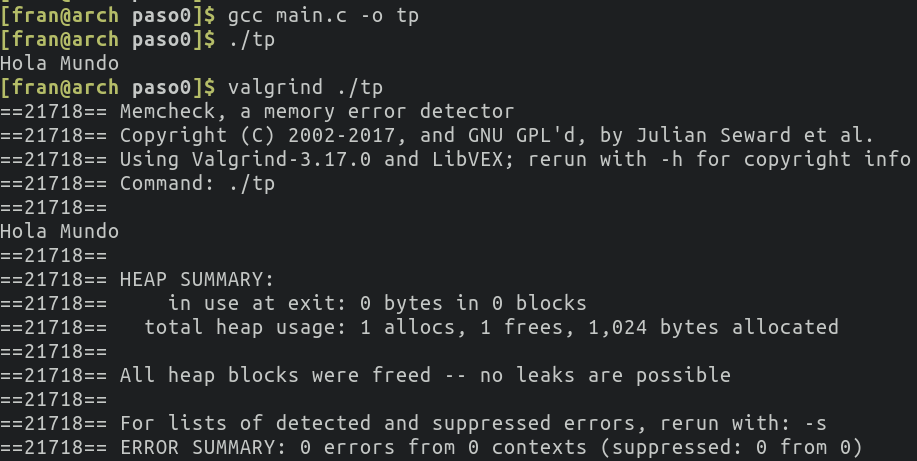

# Contador de Palabras

## Paso 0
#### a. Capturas de pantalla de la ejecución del aplicativo (con y sin Valgrind).

#### b. ¿Para qué sirve Valgrind? ¿Cuáles son sus opciones más comunes?

Valgrind es una herramienta que sirve para detectar si hay memoria que fue alocada pero nunca se liberó. Al ejecutar un programa con valgrind vamos a obtener una salida con un **HEAP SUMMARY**. Esta sección de la salida de valgrind nos indica la cantidad de *allocs* y la cantidad de *frees* que se realizar durante la ejecución del programa. 

#### c. ¿Qué representa sizeof()? ¿Cuál sería el valor de salida de sizeof(char) y sizeof(int)?

La función *sizeof()* sirve para obtener la cantidad de bytes alocados para una variable o tipo de dato. La salida de esta función para un mismo tipo de dato puede variar según la arquitectura.

El valor de sizeof(char) es 1 y el de sizeof(char) es 4.

#### d. ¿El sizeof() de una struct de C es igual a la suma del sizeof() de cada uno sus elementos? Justifique mediante un ejemplo.

Esto es falso. Si al compilador no le damos ninguna instrucción indicando como queremos que sea el layout, los campos del struct estarán alineados a 4 bytes. 

Como ejemplo, veamos el struct que se muestra a continuación:

~~~c
struct ejemplo {
    char a;
    int b;
    char c;
} ejemplo_t;
~~~

La suma de los sizeof de cada campo es 1 + 4 + 1 = 6. Sin embargo, si calculamos el sizeof de ejemplo_t obtenemos el valor 12. Esto se debe a que los campos se alinean a 4 bytes para que el acceso sea más rápido.

##### e. Investigar la existencia de los archivos estándar: STDIN, STDOUT, STDERR. Explicar brevemente su uso y cómo redirigirlos en caso de ser necesario (caracteres > y <) y como conectar la salida estándar de un proceso a la entrada estándar de otro con un pipe (carácter | ).

Cuando se invoca la función main, ya se encuentran disponibles los tres canales estandar de entrada y salida. Estos son:

* **stdin**: Entrada estandar (canal por cual ingresan datos al programa, en general a través del teclado o tomando la salida de otro programa)

* **stout**: Salida estandar (canal por el cual programa devuelve los datos, en general por la pantalla)

* **stderr**: Error estandar (canal por el cual se envían los mensajes de error en caso de que exista alguno)

Es posible que un programa reciba el contenido de un archivo a través de la entrada estandar. Para esto se hace uso del caractér **<**. Por ejemplo, si tenemos un archivo entrada.txt podemos hacer que el programa lo lea como entrada estandar de la siguiente forma:

~~~
$ ./programa < entrada.txt
~~~

También podemos redireccionar la salida estandar y el error estandar. Supongamos que queremos escribir la salida en un archivo *salida.txt* y los errores en un archivo *errores.txt*. Para esto podemos hacer lo siguiente:

~~~
$ ./programa 2> errores.txt > salida.txt
~~~

Si nos interesa escribir en un archivo la salida estandar y que los errores se impriman por pantalla:

~~~
$ ./programa > salida.txt
~~~

Para escribir los errores en un archivo e imprimir por pantalla la salida estandar:

~~~
$ ./programa 2> errores.txt
~~~

Un programa puede tomar como entrada estandar a la salida estandar de otro programa haciendo uso de los pipes (caractér |). Por ejemplo, si tenemos un programa llamado programa1 que tiene una salida y queremos que esta salida sea recibida por un programa llamado programa2 como entrada estandar, luego podemos realilzar lo siguiente:

~~~
$ ./programa1 | ./programa2
~~~
